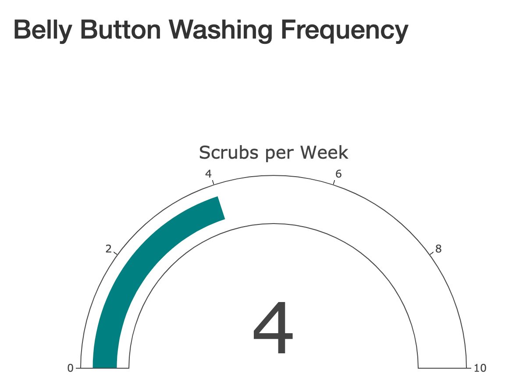

# plotly-challenge

Built an interactive dashboard to explore belly button habitats. Used a `D3` library to read in the `samples.json` dataset. Created a horizontal bar chart, bubble chart, and demographic info panel to display the data based on the ID selected from the dropdown menu. Published final dashboard to GitHub Pages.

For an additional challenge a gauge chart was added to plot the weekly washing frequency of the individual.

