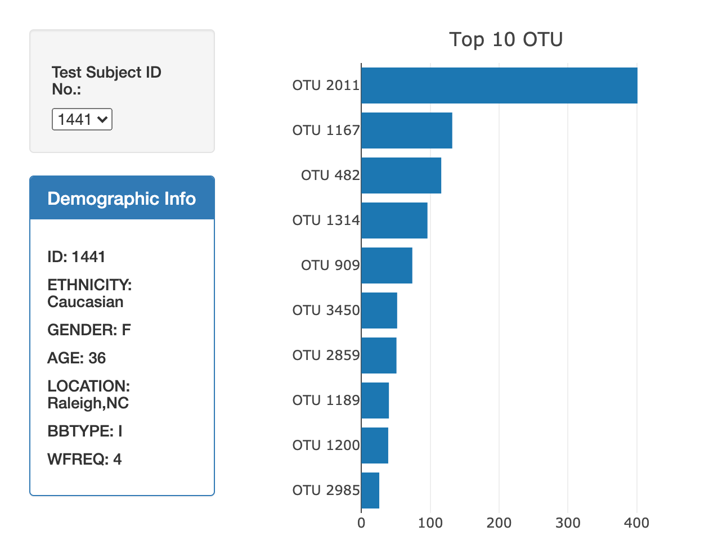
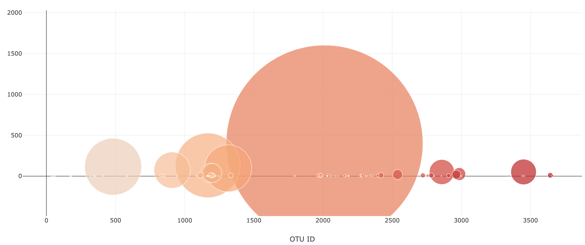

# plotly-challenge

Built an interactive dashboard to explore belly button habitats. Used a `D3` library to read in the `samples.json` dataset. Created a horizontal bar chart, bubble chart, and demographic info panel to display the data based on the ID selected from the dropdown menu.

